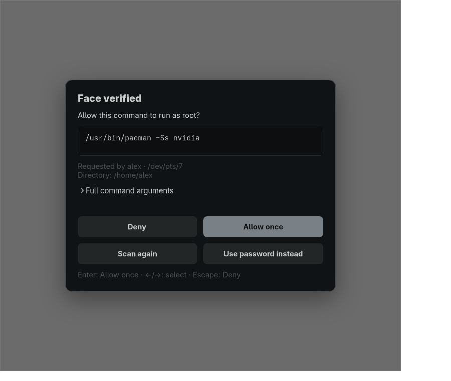

# Face Authentication for Omarchy

An Omarchy Quattro plugin for immediate IR face unlock and command-bound sudo
approval. After a face match for sudo, a theme-aware system overlay shows the
resolved executable, every argument, target account, terminal, and working
directory. **Allow once** is selected by default; Deny, rescan, and password
fallback remain available.



The bar widget opens a password-protected manager for enrolling, removing, or
clearing profiles and for enabling face authentication separately for screen
unlock and sudo. Preferences and profiles persist across reboots. Display-manager
login and disk unlock are outside this release.

The installed polkit policy only authorizes the password-protected profile and
settings manager. This release does not add face authentication to general
polkit requests or applications such as 1Password.

## Requirements

- Omarchy 4 (Quattro), x86-64
- A dedicated V4L2 IR camera node that exposes only greyscale formats
- An active local Wayland session

The detector intentionally rejects RGB and mixed-format camera nodes. See
[compatibility](docs/compatibility.md) before installing on unfamiliar hardware.

## Install

Add the plugin without enabling it, then run its installer in a visible terminal:

```bash
omarchy plugin add https://github.com/majesticio/omarchy-face-auth.git
cd ~/.config/omarchy/plugins/io.github.majesticio.face-auth
./install
```

Choose **No** if the add command offers to enable the plugin before installation;
the installer enables it after the system components are ready.

The installer shows the detected IR path, installs Arch build/runtime packages,
builds a commit-pinned howdy-next package with checksum-pinned OpenCV models,
enrolls one profile, installs the root-owned PAM/sudo integration
transactionally, and enables the combined lock service and bar widget. It asks
before camera enrollment and uses normal sudo password prompts. Close other
camera applications during enrollment.

## Use

- On the lock screen, press F8 or click **Unlock with face**. A match unlocks
  immediately; password and fingerprint paths remain available.
- For sudo, look at the IR camera, review the exact command in the overlay, and
  press Enter or click **Allow once**. Arrow keys select Deny. Escape denies.
- Click the face icon in the bar, then **Profiles & settings…** to manage profiles
  or preferences. Every mutation requires a fresh login password.

Face approval applies to one sudo request and expires after 30 seconds. Sudo
timestamp caching is disabled for the configured user. Existing NOPASSWD policy
is not changed.

## Update and remove

After `omarchy plugin update io.github.majesticio.face-auth`, run the single-prompt updater:

```bash
cd ~/.config/omarchy/plugins/io.github.majesticio.face-auth
./update
```

From an unlocked desktop terminal, restore the saved PAM, sudo, and Howdy
configuration before removing the plugin:

```bash
cd ~/.config/omarchy/plugins/io.github.majesticio.face-auth
./uninstall
omarchy plugin remove io.github.majesticio.face-auth
```

The uninstaller retains face models and packages. After restoration, they can be
removed explicitly with `sudo howdy -U "$USER" -y clear` and
`omarchy pkg drop omarchy-face-auth-howdy-next`.

## Security and privacy

The privileged controller never executes the displayed command. Sudo supplies
the final policy-approved command and resumes it only after the approval callback
accepts. Face evidence stays within that sudo process, is consumed once, and is
never exposed through a public socket or token. Camera frames, passwords, command
arguments, and embeddings are not logged; snapshot saving is disabled.

This recognizer does not provide Windows Hello-class liveness or spoof resistance.
The overlay is not a secure-attention key, and software that controls the desktop
can interact with it. Read [SECURITY.md](SECURITY.md) for the full trust model.

## Development

```bash
./scripts/check
python3 tests/native_ui_checks.py
```

The main suite uses private PAM configurations, fake recognition, and temporary
profiles. It does not open a camera, change host authentication, or lock the
session. `native/` contains the root controller, GTK overlay, and sudo DSO;
`plugin/` contains the Omarchy lock clone; `widget/` contains the bar panel;
`packaging/` contains reproducible dependency recipes.

When Omarchy changes its stock lock plugin, maintainers can run
`./scripts/resync-lock`. It reapplies `patches/face-lock.patch` to the current
stock files, runs validation, and restores the previous clone if anything fails.

Licensed under MIT. The Omarchy-derived lock files and external dependencies are
identified in [NOTICE](NOTICE) and [source provenance](docs/provenance.md).
